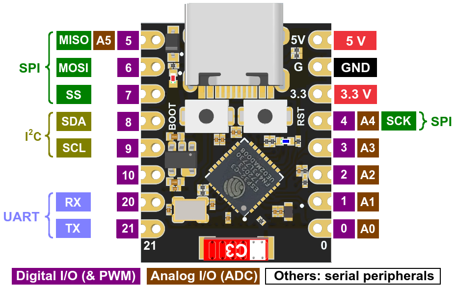
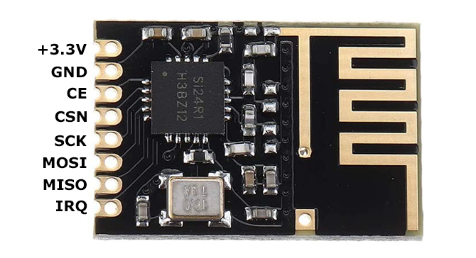

# Tipps

### Dynamische Payload auf beiden Seiten (Transmitter und Receiver) aktivieren:

    radio.enableDynamicPayloads();

Anmerkung: Payload ist physikalisch auf 32 bytes begrenzt

### Konfiguration für ESP32-C-SuperMini

#### Damit der Upload funktioniert, müssen in der platform.io diese Flags gesetzt werden:

    build_flags =
        -D ARDUINO_USB_MODE=1
        -D ARDUINO_USB_CDC_ON_BOOT=1

Falls der Upload des Programms über USB nicht funktioniert, BOOT und RESET Buttons auf dem Board gleichzeitig drücken, dann zuerst RESET loslassen und dann BOOT

### Pinbelegungen

#### ESP32-C3-SuperMini

#### nRf24 Modul

### Verbindung ESP32-C3-Supermini zu nRf24

| nRF24 |       | ESP32-C3      |
| ----- | ----- | ------------- |
| CE    | <---> | GPIO09        |
| CSN   | <---> |  GPIO10       |
| SCK   | <---> | SCK (GPIO04)  |
| MOSI  | <---> | MOSI (GPIO06) |
| MISO  | <---> | MISO (GPIO05) |

### Idee für Senden und Empfangen von Nachrichten > 32 bytes

1. Die Nachricht wird über Serial an Arduino übergeben
2. Die Länge der Nachricht wird geprüft und die Anzahl der Payloads ermittelt
3. Die erste Payload enthält als Befehlscode z.B. **MPMG** _MultiPayloadMessaGe_ und die Anzahl der folgenden Payloads. Beispiel **MPMG03**
4. Der Sender sendet **MPMG03** und wartet auf die Bestätigung vom Empfänger
5. Der Empfänger empfängt **MPMG03** und geht in den Empfangsmodus für 3 weitere Payloads
6. Der Sender erhält die Empfangsbestätigung für die Payload mit der MPMG03 Nachricht und sendet die Payload mit dem ersten Teil der Nachricht
7. Der Empfänger empfängt die Payload mit dem ersten Teil der Nachricht, schickt die Empfangsbestätigung zurück und wartet auf den zweiten Teil der Nachricht.
8. Der Sender erhält die Bestätigung über den Empfang des ersten Teils der Nachricht und sendet den zweiten Teil der Nachricht
9. Wiederholung der Schritte 6 bis 8, bis die ganze Nachricht gesendet wurde.
10. Die Nachricht wird im Empfänger aus allen Payloads zusammengesetzt und ausgewertet.
